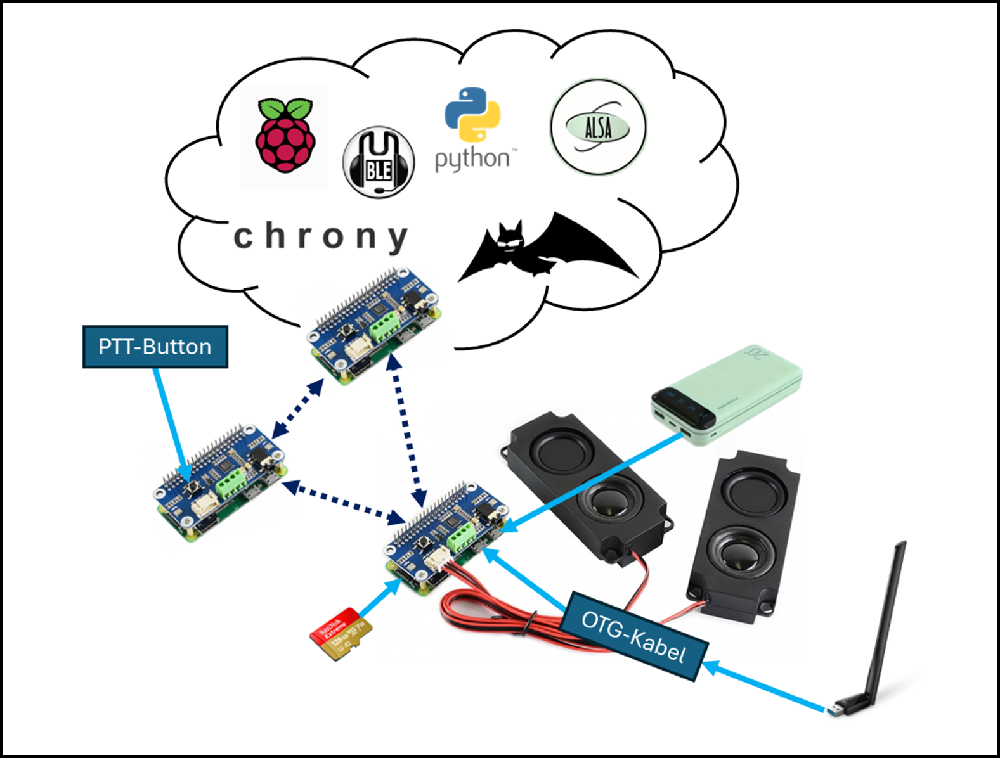

# Walkie-Talkie Pi
*Developed by Davide Bossi (TEKO Zürich, 2025)*  

---

## Overview

**Walkie-Talkie Pi** is a decentralized, push-to-talk voice communication system built entirely on open-source software and low-cost Raspberry Pi hardware.  
Each node combines a Raspberry Pi Zero 2 WH with a WM8960 Audio HAT and connects to others through a self-organizing WLAN mesh network using **batman-adv**.  
This setup enables local, encrypted voice communication **without any central server or Internet access**.  

The project was created as part of a diploma thesis at TEKO Zürich, demonstrating that fully autonomous digital voice systems can be realized with simple components and Linux-based software.

---

## Key Features

- 🗣️ Encrypted voice communication via **Mumble VoIP**
- 🔁 Automatic **server fallback and reconnection**
- 🔊 Hardware-based **push-to-talk (PTT)** button
- 📶 Layer-2 **mesh networking** with batman-adv
- ⚙️ Fully automated **systemd-based startup**
- 🔋 Runs on battery-powered Raspberry Pi Zero 2 WH
- 🌐 Operates completely offline

---

## How It Works

Each node runs both a **Mumble Server** and a **Mumble Client**.  
At startup, the node joins the mesh network, launches the VoIP services, and connects automatically to the primary server.  
If that server goes offline, a Python fallback script reconnects the client to the next reachable node.  
The PTT service controls audio capture at the ALSA layer through PulseAudio: the microphone is only active while the hardware button is pressed.

---

## Hardware Setup

| Component | Purpose |
|------------|----------|
| **Raspberry Pi Zero 2 WH** | Core single-board computer |
| **WM8960 Audio HAT** | Integrated sound card, microphone & speaker |
| **USB Wi-Fi Adapter** | Dedicated mesh interface (Ad-Hoc / 802.11s mode) |
| **USB On-The-Go Adapter (USB OTG)** | Adapter for Wi-Fi |
| **Micro SD Card (32–128 GB)** | System storage |
| **Power Bank ≥ 2 A output** | Portable power supply |
| **PTT Button (GPIO 17)** | Activates microphone while pressed |

---

## Software Stack

| Layer | Component | Description |
|--------|------------|-------------|
| **Application** | Mumble Client + Server | Encrypted VoIP communication |
| **Audio** | PulseAudio → ALSA | Sound routing and device control |
| **Mesh Networking** | batman-adv | Layer-2 routing between nodes |
| **Control** | Python Scripts + systemd Units | PTT control, fallback, autostart |
| **Time Sync** | chrony | Local NTP across mesh nodes |
| **OS** | Raspberry Pi OS (32-bit) | Base operating system |

---

## Network Concept

- **Mesh Network (bat0 on wlan1):** 10.30.5.0/24
  - pi-node-1 → 10.30.5.10
  - pi-node-2 → 10.30.5.20
  - pi-node-3 → 10.30.5.30
- **Optional Management Network (wlan0):** 172.30.5.0/24 (development only)

---

## System Architecture



This diagram shows the full system architecture, including hardware and software components used to build the VoIP mesh network.

---

## Getting Started

### 1️⃣ Prepare the Raspberry Pi
1. Flash **Raspberry Pi OS (32-bit)** to the SD card using Raspberry Pi Imager.  
2. Enable SSH and VNC (optional).  
3. Boot the Pi and run:  
   ```bash
   sudo apt update && sudo apt upgrade -y
   ```

### 2️⃣ Enable the WM8960 Audio HAT
Edit `/boot/firmware/config.txt`:  
```bash
dtparam=i2c_arm=on
dtparam=i2s=on
dtparam=audio=off
dtoverlay=wm8960-soundcard
```

### 3️⃣ Install Core Packages
```bash
sudo apt install -y batctl mumble mumble-server alsa-utils pulseaudio chrony python3
```

### 4️⃣ Set Up the Mesh Network
Example `mesh-setup.sh`:
```bash
#!/bin/bash
ip link set wlan1 down
iwconfig wlan1 mode ad-hoc
iwconfig wlan1 essid WalkieMesh
iwconfig wlan1 channel 1
ip link set wlan1 up
modprobe batman-adv
batctl if add wlan1
ip link set up dev bat0
ip addr add 10.30.5.10/24 dev bat0
```
Enable as systemd service (`mesh.service`).

### 5️⃣ Add PTT and Fallback Services
- **ptt.py:** controls recording via GPIO → ALSA → PulseAudio  
- **mumble_fallback.py:** switches client to next server if connection drops  
- Install and enable services:  
  ```bash
  sudo systemctl enable --now ptt.service
  sudo systemctl enable --now mumble-client.service
  ```

---

## Configuration Files

| File | Purpose |
|------|----------|
| `/etc/mumble-server.ini` | Local Mumble Server settings |
| `/usr/local/bin/ptt.py` | GPIO PTT script |
| `/usr/local/bin/mumble_fallback.py` | Server failover logic |
| `/usr/local/bin/mesh-setup.sh` | Mesh initialization script |
| `/etc/systemd/system/*.service` | Autostart unit files |
| `/etc/chrony/chrony.conf` | Local time sync |

---

## Operating the System

1. Power on the Pi.  
2. Mesh initializes automatically, then VoIP client connects to primary server.  
3. Press the PTT button to transmit voice (only active while pressed).  
4. If the primary server goes down, the client switches to a backup node.  
5. When the primary returns, it reconnects automatically.

---

## Troubleshooting & Diagnostics

| Area | Command | Purpose |
|-------|----------|----------|
| Mesh | `sudo batctl n` | Show neighbors |
| Mesh | `sudo batctl ping <IP>` | Ping over mesh |
| Audio | `arecord -l`, `aplay -l` | List devices |
| Audio | `alsamixer` | Adjust levels |
| Services | `systemctl status <service>` | Check service health |
| Time | `chronyc tracking` | Verify sync |

---

## Known Issues

- Limited WLAN range (~60 m line of sight).  
- Slight latency when reconnecting after fallback.  
- Not optimized for high traffic or more than 5 nodes.  
- Powerbank auto-shutdown must be disabled.

---

## Future Improvements

- Add LoRa or other long-range modules.  
- Integrate status display (OLED / TFT).  
- Design mechanical enclosure for field use.  
- Expand mesh to > 10 nodes for stress testing.  
- Harden system for outdoor operation.

---

## License

This project is licensed under the **MIT License**

---

## Acknowledgments

Special thanks to  
**TEKO Zürich / Swiss Technical College**, mentors, and everyone who supported the project during development.
